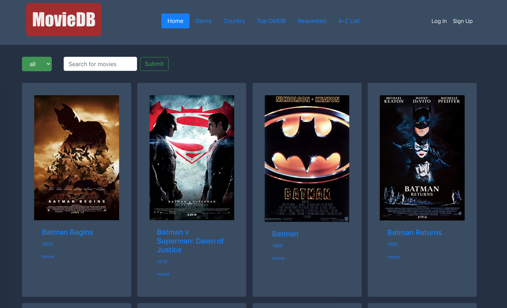
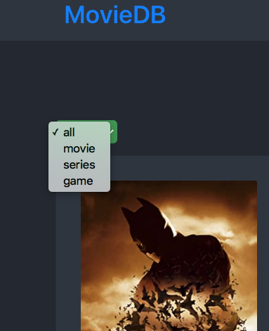
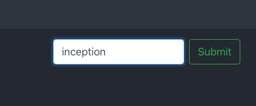

# Movie DB
A front-end React and Redux movie data application built with OMDB API.



## Table of Contents

* [Live Demo](#demo)
* [Features](#features)
* [Installation](#installation)
* [Built With](#built-with)
* [Contributing](#contributing)
* [Acknowledgments](#acknowledgments)
* [Authors](#author)
* [License](#license)

## Demo

[MovieDB](https://moviedb-2729.herokuapp.com/)

## Features

The initial state of the application shows a list of movies

Predefined state filter for this list is set to 'All', which means that the full list of results will be shown.

A user can also filter movies by type:
- movie
- series
- game



A user can search for movies within the search bar:



## Installation

You can get a local copy of the repository please run the following commands on your terminal:
```
$ cd <folder>
$ git clone git@github.com:dansantander/moviedb.git
$ npm install
$ npm start
```

## Built With
- React
- Redux
- React-DOM
- React-Create-App
- React Testing Library
- JavaScript
- Bootstrap
- Heroku

## Contributing

Contributions, issues and feature requests are welcome!

You can do it on [issues page](issues/).

## Acknowledgments

Special thanks to code reviewers.

## Show your support

Give a ⭐️ if you like this project!

## Authors

👤 **Daniel Santander**

- Github: [@dansantander](https://github.com/dansantander)
- Linkedin: [Daniel Santander](https://www.linkedin.com/in/daniel-santander)
- Twitter: [@dansantandr](https://twitter.com/dansantandr)

## License

<strong>Creative Commons 2020</strong>